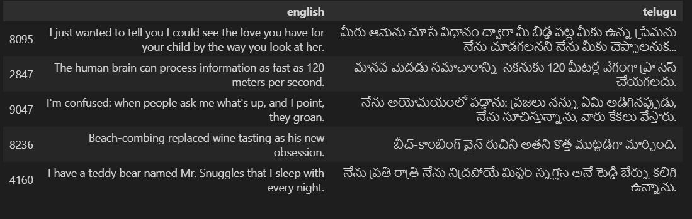
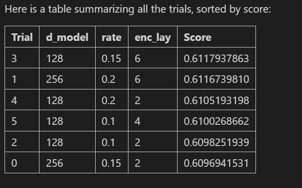
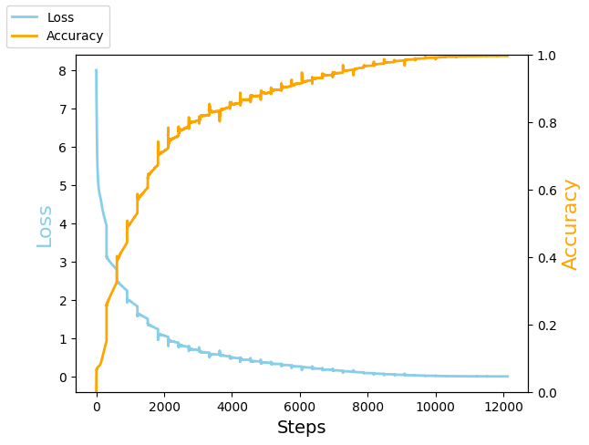
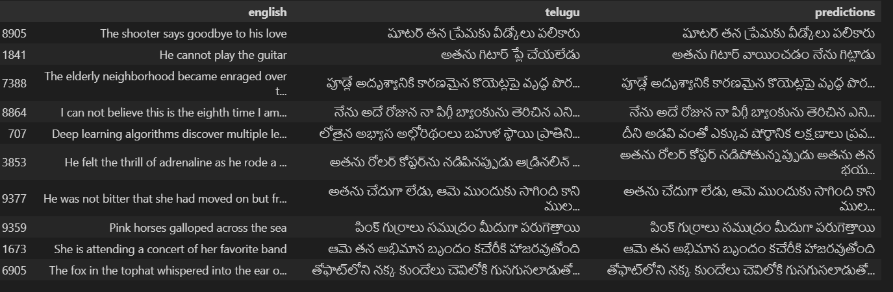
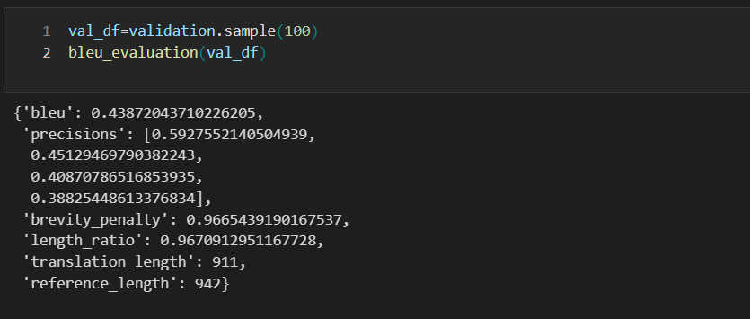
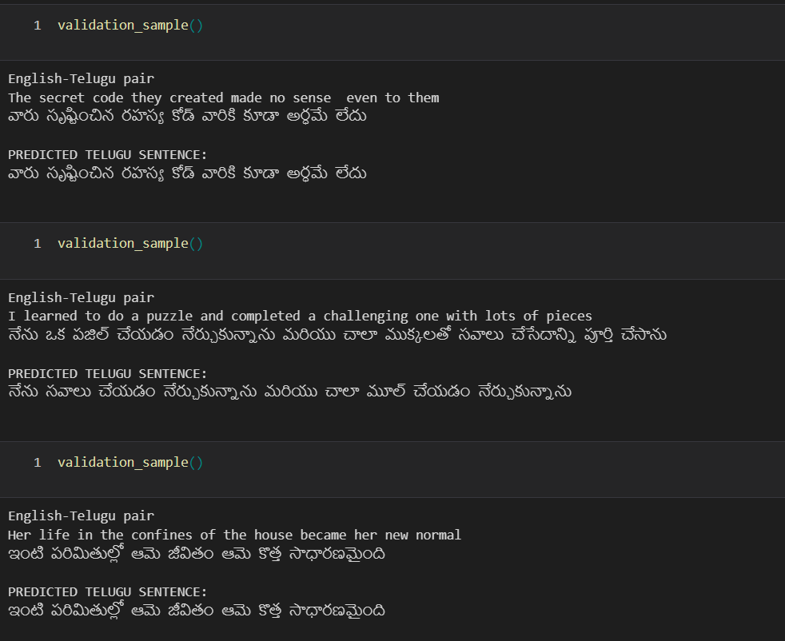

# English to Telugu Translator Using Transformer Architecture
---

[Introduction,](#introduction)
[Why Transformer Architecture ?,](#why-transformer-architecture-)
[Details of the Transformer Architecture Implemented,](#details-of-the-transformer-architecture-implemented)
[Preprocessing the Datasets,](#preprocessing-the-datasets)
[How Training is Done,](#how-training-is-done)
[Hyperparameter Tuning,](#how-hyperparameter-tuning-is-done-to-select-best-model)
[Parameter Tuning,](#how-parameter-tuning-is-done-after-hyperparameter-tuning)
[Results of Training,](#results-of-training)
[BLEU Evaluation,](#evaluation-of-the-model)
[Conclusion](#conclusion)

## Introduction

In the domain of natural language processing (NLP), language translation is a challenging task that involves converting text from one language to another while preserving its meaning and context. Traditional methods like bidirectional Long Short-Term Memory (LSTM) networks have been widely used for this purpose. However, the advent of the Transformer architecture has introduced a more effective and efficient approach to handle the complexities of language translation. This project presents the development of an English to Telugu translator built from scratch implementing Transformer architecture using the TensorFlow and keras framework.This project is built using Keras subclassing APIs for flexibility and control over the architecture's design, custom training loop and using scheduled learning rates for optimized convergence.Finally the translation quality is evaluated using the BLEU score metric.

## Why Transformer Architecture ?

### Limitations of Bidirectional LSTMs

Bidirectional LSTMs have been effective in handling sequential data and capturing dependencies across time steps. However, they suffer from several limitations: **Sequential Processing,** **Long-term Dependencies,** **Fixed Context Window**

### Advantages of Transformer Architecture

The Transformer architecture addresses these limitations with the following features: **Parallel Processing,** **Self-Attention Mechanism,** **Contextual Representation,** **Scalability**

## Details of the Transformer Architecture Implemented

### Model Components

1. **Embedding Layer**: The embedding layer converts input tokens into dense vectors of fixed size. Each token is represented as a continuous vector, capturing semantic information about the word.

2. **Positional Encoding**: Since Transformers do not have inherent knowledge of the order of tokens, positional encoding is added to the embeddings to retain the order of words. This helps the model understand the position of each word in the sentence.

3. **Multihead Attention**: Multihead attention allows the model to focus on different parts of the sentence simultaneously. Multiple attention heads enable the model to capture various aspects of the context, enhancing its ability to understand complex dependencies.

4. **Feedforward Neural Network**: After the attention mechanism, the output is passed through a feedforward neural network consisting of dense layers. This helps in further processing the information captured by the attention mechanism.

5. **Layer Normalization and Dropout**: Layer normalization is applied after each sub-layer to stabilize training and prevent overfitting. Dropout is used to randomly deactivate a fraction of neurons during training, which helps in regularizing the model.

6. **Output Layer**: The output layer produces a probability distribution over the target vocabulary. It uses a softmax function to generate the probabilities for each word in the vocabulary, given the context from the preceding tokens.

### Customization with Keras Subclassing

The model is built using Keras subclassing APIs, providing flexibility to customize the architecture.Keras subclassing enables the creation of custom layers, models, and training loops, giving precise control over the model's behavior.

## Preprocessing the Datasets

### Dataset Collection

The training dataset consists of 10205 parallel English-Telugu sentence pairs.

**Samples of dataset**

### Data Preprocessing Steps

1. **Tokenization:** Tokenization involves splitting text into smaller units, such as subwords, using the **WordPiece** algorithm. In this project, the `tfds.deprecated.text.SubwordTextEncoder.build_from_corpus()` function is used. This function processes a large corpus of text data, starting with individual characters and iteratively merging the most frequent pairs to form subword units.This approach ensures that the text is efficiently preprocessed, with suitable handling of both frequent and rare words through WordPiece subword tokenization.

2. **Vocabulary Creation:** Vocabulary creation generates a set of unique tokens from the tokenized corpus, assigning each token a unique integer index. The Telugu dataset resulted in a vocabulary of 2,768 subwords, while the English dataset has 8,566 subwords.

3. **Padding**: Padding ensures that all sequences are of the same length for batch processing. Shorter sequences are padded with a special token to match the length of the longest sequence in the batch.

4. **Cleaning**: Data cleaning involves removing noise such as special characters and other irrelevant information. It also includes normalizing text to a consistent format, such as lowercasing and removing extra spaces.

### Some distributions to get the details of the Dataset

**Frequency distribution of sequence lenghts of sentences**

**Frequency distribution of subword id's**

**Frequency of top 50 english subwords**

**Frequency of top 50 telugu subwords**

## How Training is Done

### Custom Training Loop

A custom training loop is implemented to have greater control over the training process. This includes:

- **Forward Pass:** Implemented with `tf.GradientTape()` for computation.
- **Loss Calculation:** Uses sparse categorical cross-entropy to guide optimization.
- **Backward Pass:** Computes gradients using backpropagation for parameter updates.
- **ADAM Optimizer:** Updates parameters using ADAM optimizer for efficient convergence.
- **Learning Rate Scheduling:** Utilizes cosine decay to adjust learning rates over time, typically starts with initial rate, linearly ramps to target over warmup, then decays cosine-like to minimum learning rate.

## How Hyperparameter Tuning is Done to Select Best Model

### Using KerasTuner

KerasTuner is utilized to find the best hyperparameters. The process involves:

1. **Defining the Search Space**: The search space includes hyperparameters such as the number of layers, embedding dimensions, learning rate, batch size, and dropout rate. These hyperparameters significantly affect the model's performance and training efficiency.But we are using number of layers,embedding dimensions, dff of feed forward layer, dropout rate as hyperparameters and remaining are fixed such as vocabulary size,learning rate,batch size.

2. **Running Trials**: Multiple models are trained with different hyperparameter combinations. KerasTuner systematically explores the search space with various number of executions from strach with new intializations per trail to avoid model falling in the plateau region of loss and evaluating their performance based on the Accuracy. The best model is selected based on the highest Accuracy score achieved during the trials.

**Trail 2 has almost same accuracy(0.6098) even with 2 layers than with Trail 3 of 6 layers ,Therefore choosing trail 2 for further training with more number of epochs**

Trial 2 details:
Hyperparameters:
d_model=128,
rate=0.1,
enc_lay=2

**Complete Details of the Transformer model choosen hyperparameters:**

 max_seqlen=512, 
 d_model=128, 
 telugu_vocab_size=2770, 
 english_vocab_size=8568, 
 heads=8, 
 dff=4*d_model, 
 rate=0.1, 
 enc_lay=2, 
 dec_lay=2.

## How Parameter Tuning is Done After Hyperparameter Tuning

### Further Training of the Selected Model

Once the best model is selected based on hyperparameter tuning, it is trained for more epochs to further refine its parameters and enhance learning. This involves increasing Epochs to extend the training duration allows the model to learn more complex patterns and improve its generalization capabilities.

### Learning Rate Scheduling

A cosine decay learning rate schedule is implemented in training, it starts with a initial learning rate and then gradually increases linearly to a target learning rate in predefined warmup steps their after it gradually decreases to minimum learning rate with cosine curve over predefined decay steps as shown in the above figure. This approach helps in achieving faster convergence and avoids getting stuck in local minima.

## Results of Training

Throughout the training process, both training loss and accuracy of training samples were monitored to ensure the model's effectiveness. The results, as shown in the figure below, indicate a increase in accuracy of training samples with decrease in training loss over steps. The rapid decrease in loss intially shows the model faster convergence due to the cosine decay scheduled learning rate.

**Some random predictions of validation samples**

## Evaluation of the Model

### Evaluation Metrics

The model’s performance is evaluated using the BLEU score.The BLEU score measures translation quality by comparing the model's output to reference translations. A higher BLEU score indicates better performance. The BLEU score calculation involves comparing n-grams in the model's translations to those in the reference translations, measuring precision.

### BLEU Score

The results demonstrate that the Transformer-based translator significantly improves translation quality compared to traditional methods like bidirectional LSTMs.

### Qualitative Analysis

The qualitative analysis involves examining how well the model preserves the meaning and context of the source text in its translations.Some sample translations shown below shows the contextual richness of the translations without loosing meaning.The Transformer model's ability to handle long-term dependencies and subtle semantic nuances is evident in these samples.

**Translation Quality**: The translations produced by the model capture the nuances and context of the source text effectively. The use of multihead attention and the Transformer architecture's ability to consider the entire context of the sentence contribute to high-quality translations.

## Conclusion

This project presents a comprehensive approach to building an English to Telugu translator using the Transformer architecture. The flexibility of Keras subclassing APIs, combined with a custom training loop and scheduled learning rates, allows for effective training of the model. The use of multihead attention mechanisms enhances the model's ability to handle long-term dependencies, resulting in more accurate and contextually rich translations. The application of KerasTuner for hyperparameter optimization further refines the model's performance. The results, evaluated using the BLEU score, demonstrate the efficacy of this approach in producing high-quality translations. This work highlights the superiority of Transformer architecture in language translation tasks.

---
