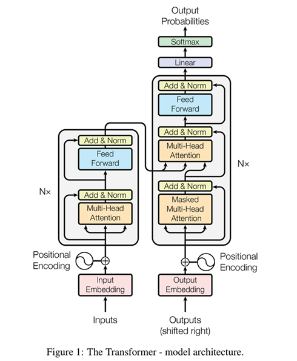
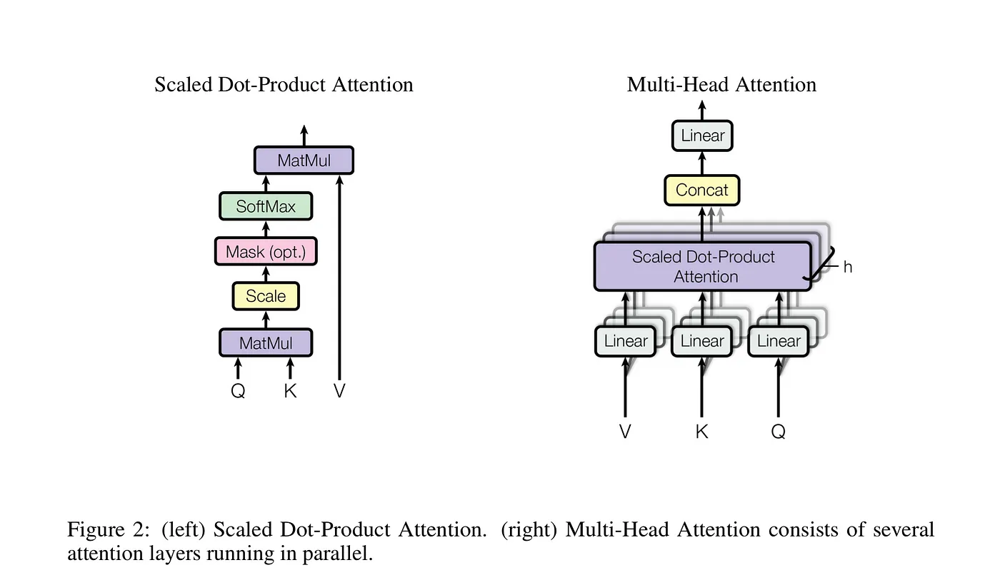
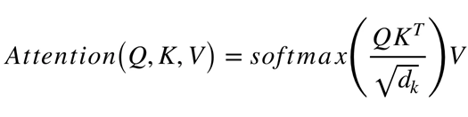
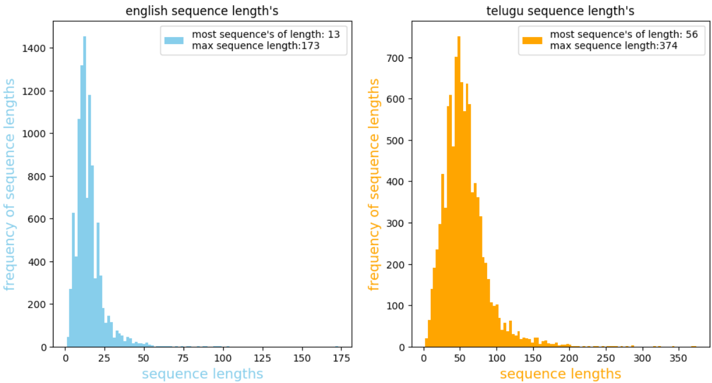
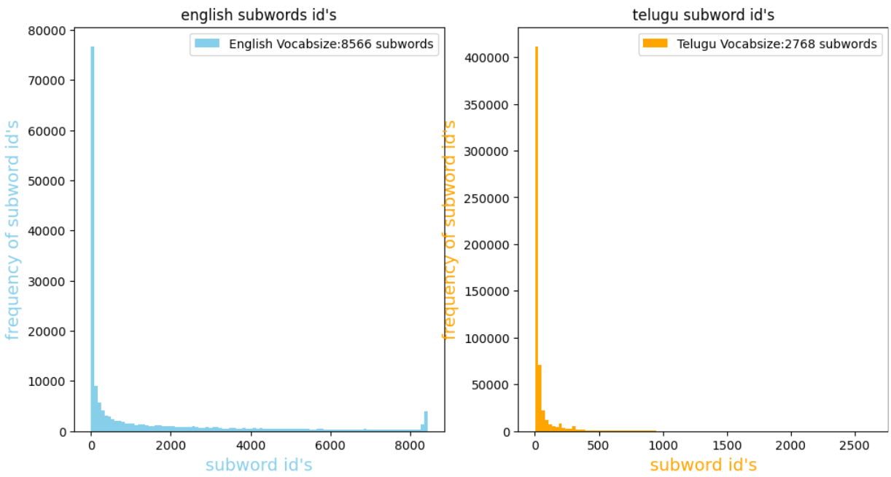
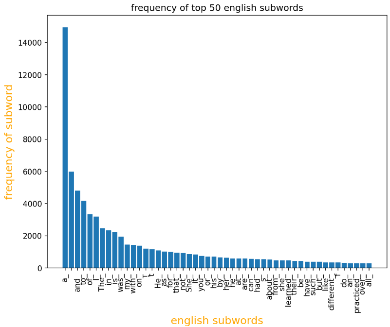
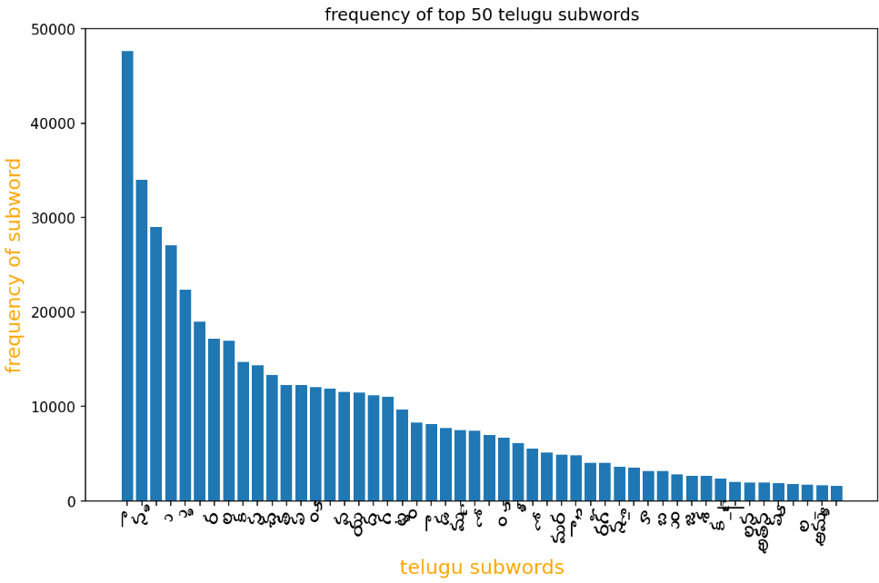
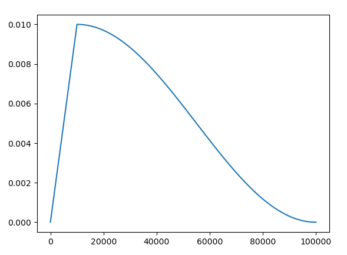

# English to Telugu Translator Using Transformer Architecture

## Introduction

In the domain of natural language processing (NLP), language translation is a challenging task that involves converting text from one language to another while preserving its meaning and context. Traditional methods like bidirectional Long Short-Term Memory (LSTM) networks have been widely used for this purpose. However, the advent of the Transformer architecture has introduced a more effective and efficient approach to handle the complexities of language translation. This thesis presents the development of an English to Telugu translator built from scratch using the Transformer architecture within the TensorFlow framework. The system is designed to leverage the flexibility and control offered by Keras subclassing APIs, incorporating a custom training loop and scheduled learning rates for optimized convergence. The translation quality is evaluated using the BLEU score metric.

## Why Transformer Architecture Over Bidirectional LSTMs

### Limitations of Bidirectional LSTMs

Bidirectional LSTMs have been effective in handling sequential data and capturing dependencies across time steps. However, they suffer from several limitations: **Sequential Processing,** **Long-term Dependencies,** **Fixed Context Window**

### Advantages of Transformer Architecture

The Transformer architecture addresses these limitations with the following features: **Parallel Processing,** **Self-Attention Mechanism,** **Contextual Representation,** **Scalability**

## Details of the Transformer Architecture Implemented

### Model Components

1. **Embedding Layer**: The embedding layer converts input tokens into dense vectors of fixed size. Each token is represented as a continuous vector, capturing semantic information about the word.

2. **Positional Encoding**: Since Transformers do not have inherent knowledge of the order of tokens, positional encoding is added to the embeddings to retain the order of words. This helps the model understand the position of each word in the sentence.

3. **Multihead Attention**: Multihead attention allows the model to focus on different parts of the sentence simultaneously. Multiple attention heads enable the model to capture various aspects of the context, enhancing its ability to understand complex dependencies.

4. **Feedforward Neural Network**: After the attention mechanism, the output is passed through a feedforward neural network consisting of dense layers. This helps in further processing the information captured by the attention mechanism.

5. **Layer Normalization and Dropout**: Layer normalization is applied after each sub-layer to stabilize training and prevent overfitting. Dropout is used to randomly deactivate a fraction of neurons during training, which helps in regularizing the model.

6. **Output Layer**: The output layer produces a probability distribution over the target vocabulary. It uses a softmax function to generate the probabilities for each word in the vocabulary, given the context from the preceding layers.

### Customization with Keras Subclassing

The model is built using Keras subclassing APIs, providing flexibility to customize the architecture.Keras subclassing enables the creation of custom layers, models, and training loops, giving precise control over the model's behavior.

## Preprocessing the Datasets

### Dataset Collection

The training dataset consists of 10000 parallel English-Telugu sentence pairs.

### Data Preprocessing Steps

1. **Tokenization**: Tokenization involves splitting sentences into words or subwords. Subword tokenization techniques like Byte Pair Encoding (BPE) or WordPiece are used to handle rare words and improve the model's ability to generalize.

2. **Padding**: Padding ensures that all sequences are of the same length for batch processing. Shorter sequences are padded with a special token to match the length of the longest sequence in the batch.

3. **Vocabulary Creation**: A vocabulary is created from the dataset, which includes all unique tokens (words or subwords) in the training data. Each token is assigned a unique integer index.

4. **Cleaning**: Data cleaning involves removing noise such as special characters, HTML tags, and other irrelevant information. It also includes normalizing text to a consistent format, such as lowercasing and removing extra spaces.

**Frequency distribution of sequence lenghts of sentences**

**Frequency distribution of subword id's**

**Frequency of top 50 english subwords**

**Frequency of top 50 telugu subwords**

## How Training is Done

### Custom Training Loop

A custom training loop is implemented to have greater control over the training process. This includes:

1. **Forward Pass**: In the forward pass, the input data is fed through the model to calculate predictions. The embeddings, positional encodings, and multihead attention mechanisms process the input to produce context-aware representations.

2. **Loss Calculation**: The loss is calculated using categorical cross-entropy, which measures the difference between the predicted probability distribution and the actual target distribution. This loss is used to guide the optimization process.

3. **Backward Pass**: In the backward pass, gradients are computed for each parameter in the model using backpropagation. These gradients indicate how each parameter should be adjusted to minimize the loss.

4. **Learning Rate Scheduling**: A learning rate schedule is used to adjust the learning rate dynamically. Initially, a high learning rate helps the model converge quickly, and it is gradually reduced to fine-tune the model parameters. The learning rate schedule can follow a predefined pattern, such as the warm-up strategy followed by decay.

### Learning Rate Scheduling

A cosine decay learning rate schedule is implemented in training, it starts with a initial learning rate and then gradually increases linearly to a target learning rate in predefined warmup steps their after it gradually decreases to minimum learning rate with cosine curve over predefined decay steps as shown in the above figure. This approach helps in achieving faster convergence and avoids getting stuck in local minima.

## How Hyperparameter Tuning is Done to Select Best Model

### Using KerasTuner

KerasTuner is utilized to find the best hyperparameters. The process involves:

1. **Defining the Search Space**: The search space includes hyperparameters such as the number of layers, embedding dimensions, learning rate, batch size, and dropout rate. These hyperparameters significantly affect the model's performance and training efficiency.But we are using number of layers,embedding dimensions, dff of feed forward layer, dropout rate as hyperparameters and remaining are fixed such as vocabulary size,learning rate,batch size.

2. **Running Trials**: Multiple models are trained with different hyperparameter combinations. KerasTuner systematically explores the search space with various number of executions from strach with new intializations per trail to avoid model falling in the plateau region of loss and evaluating their performance based on the Accuracy. The best model is selected based on the highest Accuracy score achieved during the trials.

## How Parameter Tuning is Done After Hyperparameter Tuning

### Further Training of the Selected Model

Once the best model is selected based on hyperparameter tuning, it is trained for more epochs to further refine its parameters and enhance learning. This involves increasing Epochs to extend the training duration allows the model to learn more complex patterns and improve its generalization capabilities. 

2. **Fine-Tuning Learning Rate**: Further adjusting the learning rate to ensure stable and efficient convergence. The learning rate is reduced gradually to allow the model to make finer adjustments to the weights, avoiding large updates that could destabilize the training process.

## Results of Training

### Evaluation Metrics

The model’s performance is evaluated using the BLEU score. The BLEU score measures the overlap between the model's translations and reference translations, providing a quantitative assessment of translation quality. The results demonstrate that the Transformer-based translator significantly improves translation quality compared to traditional methods like bidirectional LSTMs.

### Training Performance

1. **Convergence Speed**: The model converges faster due to the scheduled learning rate. The learning rate schedule allows the model to make rapid initial progress and then fine-tune its parameters, leading to efficient training.

2. **Translation Quality**: The translations produced by the model capture the nuances and context of the source text effectively. The use of multihead attention and the Transformer architecture's ability to consider the entire context of the sentence contribute to high-quality translations.

## Evaluation of the Model

### BLEU Score

The BLEU score is used to evaluate the translation quality by comparing the model's output to reference translations. A higher BLEU score indicates better performance. The BLEU score calculation involves comparing n-grams in the model's translations to those in the reference translations, measuring precision and recall.

### Qualitative Analysis

Sample translations are reviewed to qualitatively assess the accuracy and contextual richness of the translations. The Transformer model's ability to handle long-term dependencies and subtle semantic nuances is evident in these samples. The qualitative analysis involves examining how well the

 model preserves the meaning and context of the source text in its translations.

## Conclusion

This thesis presents a comprehensive approach to building an English to Telugu translator using the Transformer architecture. The flexibility of Keras subclassing APIs, combined with a custom training loop and scheduled learning rates, allows for effective training and fine-tuning of the model. The use of multihead attention mechanisms enhances the model's ability to handle long-term dependencies, resulting in more accurate and contextually rich translations. The successful application of KerasTuner for hyperparameter optimization further refines the model's performance. The results, evaluated using the BLEU score, demonstrate the efficacy of this approach in producing high-quality translations. This work highlights the superiority of Transformer architectures over traditional bidirectional LSTMs in language translation tasks.

---

This thesis outlines the significant aspects of the translator, providing a detailed account of the architecture, datasets, training process, hyperparameter tuning, and results, concluding with the effectiveness of the Transformer architecture in NLP tasks such as language translation.
